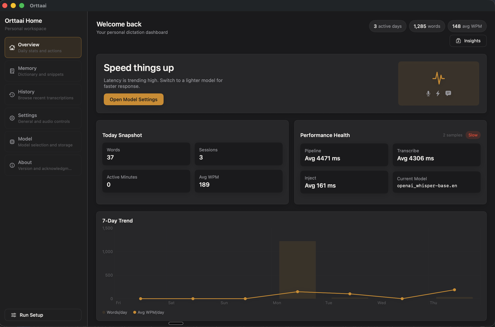
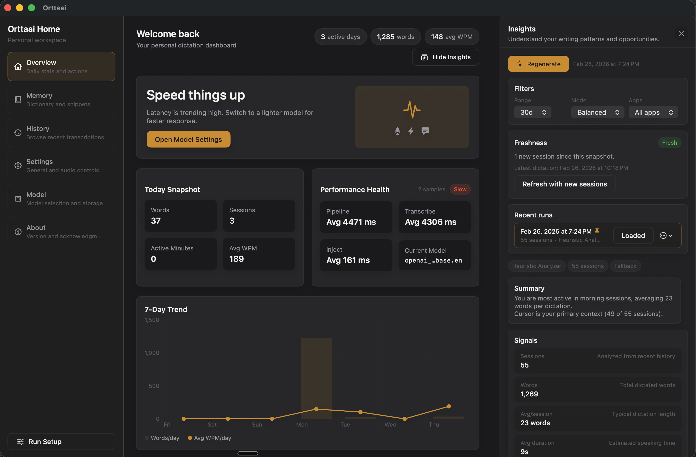
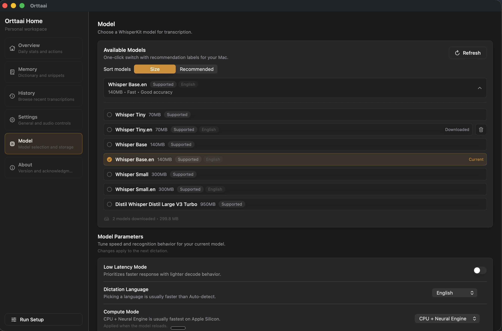

# Orttaai

<picture>
  <source media="(prefers-color-scheme: dark)" srcset="branding/orttaai/wordmarks/white/wordmark-640.png">
  <source media="(prefers-color-scheme: light)" srcset="branding/orttaai/wordmarks/charcoal/wordmark-640.png">
  
</picture>

**Native macOS voice keyboard powered by WhisperKit.**

Giving you back your second hand. Press a hotkey, speak, and your words appear at the cursor — in any app. Speech recognition always happens on-device, and by default everything else does too. Your voice never leaves your Mac.

## Features

- **Push-to-talk dictation** — Hold `Ctrl+Shift+Space`, speak, release. Text appears at your cursor.
- **Hands-free dictation** — Tap the hotkey (or the pill's mic button) to start recording without holding it, then tap again to stop, or let it stop on its own after you go quiet.
- **On-device by default** — Uses WhisperKit for local speech recognition, so audio is never uploaded. No account is required, and your text is sent nowhere unless you turn on iCloud sync or a cloud AI provider (see below).
- **Works everywhere** — Inserts text by simulated paste, with Accessibility and typing fallbacks, into the app that was focused when you started — Safari, Chrome, VS Code, Slack, Notes, and more.
- **Secure field detection** — Automatically blocks insertion into password fields, before the clipboard is touched. A blocked dictation is not saved to History.
- **Clipboard preservation** — Saves and restores your clipboard after each dictation. Copy an image, dictate, and your image is still on the clipboard.
- **Recording limits** — Set separate caps in Settings > Dictation: Push-to-Talk Limit (30s, 60s, 90s, 2 min, or 5 min; default 90s) and Hands-Free Limit (5, 10, 15, or 30 min; default 10 min), with a countdown in the pill for the final 20 seconds.
- **Stop After Silence** — Ends a hands-free recording once you stop talking for 2, 4, 6, 8, or 10 seconds (default 4s), counting only after it has heard you speak; choose Off to keep recording until you stop it.
- **Voice editing** — Select text, press `Ctrl+Shift+E`, and say how to change it ("make this more formal"); it uses your local Ollama or LM Studio model, and the selection is left untouched if the edit fails.
- **Menu bar app** — Lives in your menu bar with status icon showing current state.
- **History** — Searchable history of all transcriptions with live updates.
- **Personal Memory (Dictionary + Snippets)** — Save your own term replacements and phrase expansions, then apply them automatically during dictation.
- **AI Suggestions from History** — Generate suggested dictionary/snippet entries from your recent local history (Apple Foundation Models when available, with fallback).
- **Writing Insights panel (beta)** — Generate on-demand insights about your dictation patterns from recent history, using your selected AI provider when enabled, otherwise Apple Foundation Models when available, with a local heuristic fallback.
- **Semantic Memory Graph (beta)** — Build a local embedding index from dictation history to explore topics, apps, named contexts, and related transcript chunks.
- **Chat AI (beta)** — A writing assistant grounded in your own dictation history, with a My Tone mode that writes in your voice, file attachments, and voice input; it runs on your selected AI provider.
- **Optional AI providers** — Connect Ollama or LM Studio for on-device models, or opt in to ChatGPT through the Codex CLI or Grok through the Grok CLI using your own account. The cloud providers send the text they process (Chat AI, Writing Insights, tone profile, and graph summaries) to OpenAI or xAI; dictation polish, voice editing, and embeddings always stay on a local provider.
- **iCloud sync** — Optional, through your private iCloud account: syncs History, Personal Memory (dictionary, snippets, suggestions), insights, Chat AI conversations, your tone profile, and settings; downloaded models, audio devices, and other per-Mac settings stay on each Mac.
- **Personal Home dashboard** — Sleek at-a-glance view for 7-day activity, speed trends, top apps, and quick actions.
- **Model management** — Download and switch between Whisper models based on your hardware.
- **Auto-updates** — Sparkle integration for direct downloads; Homebrew-managed updates when installed from the custom cask tap.
- **One-click updates** — Turn on "Automatically download updates" in About, and an Update button appears at the bottom of the sidebar when a downloaded update is ready to install and relaunch (direct downloads only).

## Requirements

- macOS 14.6 (Sonoma) or later
- Apple Silicon (M1 or later)
- About 500MB of disk space for the default model (Whisper Small)

## Installation

### Homebrew

Install from the custom tap:

```bash
brew tap theoyinbooke/orttaai
brew install --cask theoyinbooke/orttaai/orttaai
```

Tap repository:
`https://github.com/theoyinbooke/homebrew-orttaai`

### Direct Download

Download the latest `.dmg` from [GitHub Releases](https://github.com/theoyinbooke/orttaai/releases).

## Screenshots

### Home Overview



### Insights Panel



### Model Management



## Brand Assets

The [Signal Cursor brand kit](branding/orttaai/README.md) includes transparent amber, white, and charcoal marks, light and dark app icons, wordmarks, a white macOS menu bar template, and SVG/PDF masters. [Preview the variations](branding/orttaai/preview.png).

Regenerate all exports and app assets with `scripts/generate_brand_assets.sh`.

## Permissions

Orttaai requires two macOS permissions, plus one optional:

1. **Microphone** — Captures your voice for transcription
2. **Accessibility** — Simulates paste to inject text at your cursor
3. **Input Monitoring (optional)** — Compatibility fallback for detecting your hotkey

Speech recognition always runs locally. Your voice never leaves your Mac, and your text stays on it too unless you enable iCloud sync or a cloud AI provider (ChatGPT via Codex, or Grok).

## Apple Foundation Models Integration

Orttaai uses **Apple Foundation Models** (on supported macOS versions/devices) for local language analysis features:

- **Memory learning suggestions** — Proposes new dictionary replacements and snippet expansions from your recent transcription history.
- **Writing insights generation** — Summarizes writing/speaking patterns in the Insights panel so you can spot habits and trends.
- **Safe fallback path** — If Apple Foundation Models is unavailable, Orttaai automatically falls back to a local heuristic analyzer.

These features are designed to stay local-first and work without sending your transcription history to external services. If you choose ChatGPT (Codex) or Grok as your AI provider, Writing Insights uses that provider instead.

## Keyboard Shortcuts

| Shortcut | Action |
|----------|--------|
| `Ctrl+Shift+Space` (hold) | Push-to-talk (hold to record, release to transcribe) |
| `Ctrl+Shift+Space` (tap) | Hands-free (tap to start, tap again to stop) |
| `Ctrl+Shift+E` | Voice editing (rewrite the selected text by voice) |

A quick tap (under about a third of a second) starts hands-free mode; turn Hands-Free Dictation off in Settings > Dictation to make every press push-to-talk. Change the dictation shortcut in Settings > Dictation and the edit shortcut in Settings > Text.

## Models

| Model | Size | RAM Required | Best For |
|-------|------|-------------|----------|
| Whisper Tiny | ~75MB | 8GB+ | Quick notes, commands |
| Whisper Tiny (English) | ~75MB | 8GB+ | Fast English dictation |
| Whisper Base | ~145MB | 8GB+ | Short dictation |
| Whisper Base (English) | ~145MB | 8GB+ | Short English dictation |
| Whisper Small | ~465MB | 8GB+ | General dictation |
| Whisper Small (English) | ~465MB | 8GB+ | General English dictation |
| Whisper Medium | ~1,450MB | 16GB+ | Longer dictation |
| Whisper Medium (English) | ~1,450MB | 16GB+ | Longer English dictation |
| Whisper Large V3 Turbo | ~1,550MB | 16GB+ | Maximum accuracy, optimized speed |
| Whisper Large V3 | ~2,950MB | 16GB+ | Highest accuracy, slowest |

## Building from Source

```bash
git clone https://github.com/theoyinbooke/orttaai.git
cd orttaai
open Orttaai.xcodeproj
```

Requirements:
- Xcode 15+
- macOS 14+ SDK
- Apple Silicon Mac (for WhisperKit)

Build: `Cmd+B`
Run: `Cmd+R`
Test: `Cmd+U`

## Sparkle Appcast (Maintainers)

Sparkle reads updates from:
`https://raw.githubusercontent.com/theoyinbooke/orttaai/main/Orttaai/Resources/appcast.xml`

The repository now publishes `appcast.xml` automatically after a GitHub Release is published.

Setup required once:

1. Export your Sparkle EdDSA private key to a file.
2. Add its contents as a GitHub Actions secret named `SPARKLE_ED_PRIVATE_KEY`.
3. Publish releases from GitHub with a DMG asset named `Orttaai-<version>.dmg`.

For local backfills or recovery, you can still regenerate manually:

```bash
scripts/update_appcast.sh --version <x.y.z>
git add Orttaai/Resources/appcast.xml
git commit -m "Update Sparkle appcast for v<x.y.z>"
git push
```

## Contributing

See [CONTRIBUTING.md](CONTRIBUTING.md) for development setup, code style, and PR process.

## License

[MIT](LICENSE)

## Acknowledgments

- [WhisperKit](https://github.com/argmaxinc/WhisperKit) — On-device speech recognition
- [Apple Foundation Models](https://developer.apple.com/documentation/foundationmodels) — On-device language analysis for memory suggestions and writing insights
- [GRDB.swift](https://github.com/groue/GRDB.swift) — SQLite database toolkit
- [Sparkle](https://github.com/sparkle-project/Sparkle) — Auto-update framework
- [KeyboardShortcuts](https://github.com/sindresorhus/KeyboardShortcuts) — Shortcut recording
